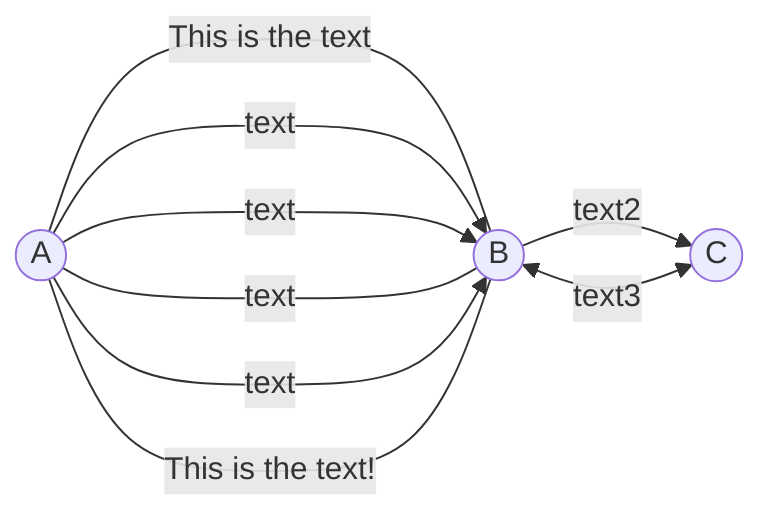
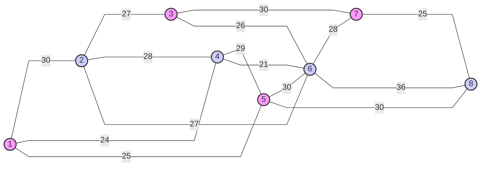

```mermaid
flowchart LR

    classDef smallNod2 fill:#f9f,stroke:#333,stroke-width:2px,width:500px,height:500px,font-size:260pt;

    A((A)):::smallNode2
    B((B)):::smallNode2
    C((C)):::smallNode2

    A---|This is the text|B
    A-->|text|B
    A-- text -->B
    A ----|text| B
    A -- text --> B -- text2 --> C
    A-- This is the text! ---B
    B <--text3--> C
```

```mermaid
%%{init: { 'flowchart': { 'curve': 'linear','htmlLabels': true } } }%%
graph LR
    classDef smallNode fill:#f9f,stroke:#333,stroke-width:2px;

    style 1 fill:#f9f,stroke:#333,stroke-width:2px, width:500px, height:500px
    style 2 fill:#ccf,stroke:#333,stroke-width:2px, width:500px, height:500px
    style 3 fill:#f9f,stroke:#333,stroke-width:2px, width:500px, height:500px
    style 4 fill:#ccf,stroke:#333,stroke-width:2px, width:500px, height:500px
    style 5 fill:#f9f,stroke:#333,stroke-width:2px, width:500px, height:500px
    style 6 fill:#ccf,stroke:#333,stroke-width:2px, width:500px, height:500px
    style 7 fill:#f9f,stroke:#333,stroke-width:2px, width:500px, height:500px
    style 8 fill:#ccf,stroke:#333,stroke-width:2px, width:500px, height:500px

    1(("  1  "))
    2(("  2  "))
    3((3))
    4((4))
    5((5))
    6((6))
    7((7))
    8((8))

    1----|30| 2
    1---|24| 4
    1----|25| 5

    2----|27| 3
    2---|28| 4
    2----|27| 6

    3----|30| 7
    3-----|26| 6

    4---|29| 5
    4---|21| 6

    5---|30| 6
    5-----|30| 8

    6---|28| 7
    6---|36| 8

    7-----|25| 8
```

## Research, Learning Resources

- [Reference 1](https://mermaid.js.org/syntax/flowchart.html)
- [Reference 2](https://jbms.github.io/sphinx-immaterial/mermaid_diagrams.html)
