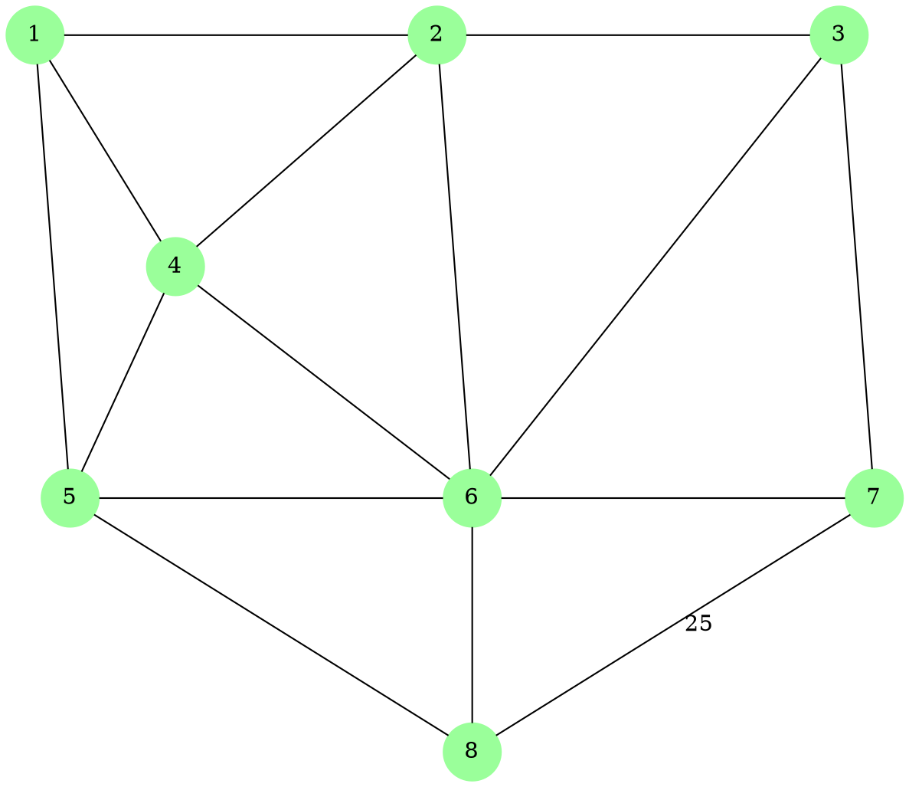
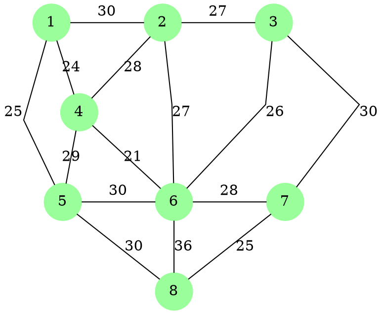

## Example 1

1. `splines=false` doesn't work well with labels - it often causes unexpected behavior
1. `splines=line` is better for straight edges with labels
1. The layout engine (dot, neato, fdp, etc.) significantly affects how edges are drawn
1. Increasing `nodesep` and `ranksep` gives more space for straight edges
1. Using `labelfloat=true` can help position labels better

- `nodesep` for horizontal spacing
- `ranksep` for more vertical spacing
- `len` values for longer individual edges

## Example 2

## Research, Learning Resources

- [Reference 1](https://magjac.com/graphviz-visual-editor/)
- [Reference 2](https://graphs.grevian.org/reference)
- [Reference 3](https://www.graphviz.org/doc/info/lang.html)
- [Reference 4](https://graphviz.org/pdf/dotguide.pdf)
- [Reference 5](https://www.devtoolsdaily.com/graphviz/#v2=N4IgJg9gLiBc4EsDmAnAhgBwBYAIBCACgLIByOwAOgHY47pUDWYCKAvADIBKA3NbVRDABTANoBnLJiGsUQgMZQ0VAEYAbITjFQAnutYUQKCAFcqwsABoAZglXqwBnHIiqIbA6uRYoSF8KpGYNpCdhAA7o4AunyaiihQ4pIY0nIscupOLm6sGGjqqEJCVACM0TQ4RWCJUqyQxmryaRnOrmxuSkhCsmBltABWEAhUFjgDQwBM1cm1CGgAthBmOKpoyiH6II5autIGNnZCDiA4+6ot2e1Unb04YWgIUCPCK9pTKU0a5+4gnkjevqp-IFigYblo0PEcABaAB8OCUAlMciEMQRJioyOhcOeaG0qKoiIxGlhOAWwnQUBR5TJXTQlKxo0GVHGMRx2gZQjm91UMU53NhY2ZMTkWHkDAA+nI8iIVmtVBsRWLqFL1GYIaD8YTMSTFXIJSrhYsrJK8qoZat1gZnFQrF0isjlaaNeVdfq8gzrcaVTyXUaTXYGXcHua5axgmIbjSKUJJUaQ5aQFG6RplUa7USnE6QDcg1AGUnKbGbTECzHPQzBYabf7VBWmfH5QIboKBUyWeVBeNYUIAG55YzJ3l91QDyndszUAC+IEnQA)
- [Reference 6](https://stackoverflow.com/questions/16488216/graph-of-graphs-in-graphviz)
- [Reference 7](https://stackoverflow.com/questions/16488216/graph-of-graphs-in-graphviz)
- [Plugin Reference 1](https://pypi.org/project/mkdocs-graphviz/)
- [Plugin Reference 2](https://eskool.gitlab.io/mkhack3rs/)
- [Plugin Reference 3](https://eskool.gitlab.io/mkhack3rs/graphviz/)
- [Plugin Reference 4](https://gitlab.com/rod2ik/mkdocs-graphviz)
- [Graph Reference](https://eskool.gitlab.io/tnsi/donnees/graphes/definitions/)
